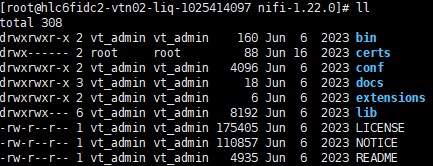
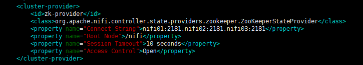
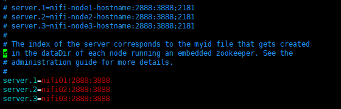

# HƯỚNG DẪN CÀI ĐẶT APACHE NIFI

### Mục lục

- [1.1. Cấu hình các thông số máy chủ ](#cauhinhmaychu)
    - [1.1.1. Cấu hình hostname (Cần quyền root)](#cauhinhhostname)
    - [1.1.2. Cấu hình iptables/firewalld (Cần quyền root)](#cauhinhiptables)
    - [1.1.3. Cài đặt Java (Cần quyền root)](#caidatjava)
    - [1.1.4. Tạo user ứng dụng  (Cần quyền root)](#taouserud)
    - [1.1.5. Cài đặt ứng dụng  (Cần quyền root)](#caidatud)
- [1.2. Cấu hình Apache Nifi (user nifi)](#cauhinhnifi)
    - [1.2.1. Chỉnh sửa file nifi.properties Apache Nifi ](#suafile.properties)
    - [1.2.2. Chỉnh sửa file state-management.xml](#suafile.statemanagement.xml)
    - [1.2.3. Chỉnh sửa file zookeeper.properties](#suafile.zkproperties)
    - [1.2.4. Chỉnh sửa java heap](#suajavaheap)
    - [1.2.5. Chỉnh sửa file authorizers.xml](#suafile.authorizers)
- [1.3. Khởi động và tạo user để truy cập từ web browser](#khoitao)
- [1.4. Truy cập nifi từ PC](#chay)


<a name="cauhinhmaychu"></a> 
### 1.1. Cấu hình các thông số máy chủ 

<a name="cauhinhhostname"></a>
#### 1.1.1. Cấu hình hostname (Cần quyền root)

Có thể cấu hình hostname của toàn bộ node mạng trong cụm cluster bằng cách thêm vào file /etc/hosts của các node, ví dụ dưới là của 1 máy chủ khai báo cho 3 node trong cluster:

```
10.254.140.97 nifi01
10.254.140.98 nifi02
10.254.140.99 nifi03
```

<a name="cauhinhiptables"></a>
#### 1.1.2. Cấu hình iptables/firewalld (Cần quyền root)

Cấu hình mở iptables giữa các node 

```
-A INPUT -s 10.254.140.97/32 -p tcp -m state --state NEW -m tcp -m multiport --dports 22,2888,3888,443,80,8080:8082,2181,8088,8443,9991 -m comment --comment "Khai bao Composable" -j ACCEPT
-A INPUT -s 10.254.140.98/32 -p tcp -m state --state NEW -m tcp -m multiport --dports 22,2888,3888,443,80,8080:8082,2181,8088,8443,9991 -m comment --comment "Khai bao Composable" -j ACCEPT
-A INPUT -s 10.254.140.99/32 -p tcp -m state --state NEW -m tcp -m multiport --dports 22,2888,3888,443,80,8080:8082,2181,8088,8443,9991 -m comment --comment "Khai bao Composable" -j ACCEPT
```

<a name="caidatjava"></a>
#### 1.1.3. Cài đặt Java (Cần quyền root)

```
yum install java-1.8.0-openjdk
```

Kiểm tra sau khi cài đặt:

```
java -version
```

<a name="taouserud"></a>
#### 1.1.4. Tạo user ứng dụng  (Cần quyền root)

```
useradd nifi
passwd nifi
```

<a name="caidatud"></a>
#### 1.1.5. Cài đặt ứng dụng  (Cần quyền root)

Download ứng dụng từ website: [Nifi](https://nifi.apache.org/download)

Download ứng dụng Nifi Standard (Ứng dụng để chạy Nifi) và Toolkit (Dùng để generate cert cho cluster)

Giải nén Nifi Standard và chuyển vào trong đường dẫn `/home/nifi/`. Bên trong thư mục sẽ có các file sau:


Nifi Toolkit có thể để tùy ý nếu sử dụng user root `(/home/vt_admin)` hoặc để trong `/home/nifi` nếu sử dụng user nifi. 

Phân quyền cho thư mục:

`chown -R nifi:nifi /home/nifi/`

<a name="cauhinhnifi"></a>
### 1.2. Cấu hình Apache Nifi (user nifi)

<a name="suafile.properties"></a>
#### 1.2.1. Chỉnh sửa file nifi.properties Apache Nifi 

Mở file cấu hình nifi.properties

`vim /home/nifi/conf/nifi.properties`

Cấu hình file tham khảo thông tin dưới đây 

```
nifi.ui.banner.text=**CNTT KTTC**
nifi.state.management.embedded.zookeeper.start=true
nifi.remote.input.host=**nifi03**
nifi.remote.input.secure=true
nifi.remote.input.socket.port=8081
nifi.remote.input.http.enabled=false
nifi.web.https.host=**nifi03**
nifi.web.https.port=**8443**
nifi.sensitive.props.key=**PCNTT_TTKTTC_VTNET**
nifi.security.keystore=./conf/keystore.jks
nifi.security.keystoreType=jks
nifi.security.keystorePasswd=**AkUIvYOenUvP6srSpfKzEnWYB8UzGyFdNNmts1LMSs4**
nifi.security.keyPasswd=**AkUIvYOenUvP6srSpfKzEnWYB8UzGyFdNNmts1LMSs4**
nifi.security.truststore=./conf/truststore.jks
nifi.security.truststoreType=jks
nifi.security.truststorePasswd=**XyrUt6UO3MUPy82BQNMuK+ZwyZV2rs9MQtIw1XPMN14**
nifi.security.user.authorizer=managed-authorizer
nifi.security.allow.anonymous.authentication=false
nifi.security.user.login.identity.provider=
nifi.cluster.is.node=true
nifi.cluster.node.address=**nifi03**
nifi.cluster.node.protocol.port=9991
nifi.cluster.node.protocol.max.threads=50
nifi.cluster.node.event.history.size=25
nifi.cluster.node.connection.timeout=5 sec
nifi.cluster.node.read.timeout=5 sec
nifi.cluster.node.max.concurrent.requests=100
nifi.cluster.flow.election.max.wait.time=1 mins
nifi.cluster.flow.election.max.candidates=3
nifi.zookeeper.connect.string=**nifi01:2181,nifi02:2181,nifi03:2181**
nifi.zookeeper.connect.timeout=10 secs
nifi.zookeeper.session.timeout=10 secs
```

Trong đó: 
-	nifi03 là hostname của node 3, cấu hình theo tên từng node theo cấu hình ở bước 1.1.1
-	KeystorePasswd, keyPasswd, truststorePasswd được generate bằng HD tạo certificate cho Apache Nifi  

Tham khảo file mẫu:

 

<a name="suafile.statemanagement.xml"></a>
#### 1.2.2. Chỉnh sửa file state-management.xml

Mở file state-managent.xml
`vim /home/nifi/conf/state-management.xml`

Chỉnh sửa file theo mẫu dưới đây:

```
    <cluster-provider>
        <id>zk-provider</id>
        <class>org.apache.nifi.controller.state.providers.zookeeper.ZooKeeperStateProvider</class>
        <property name="Connect String">nifi01:2181,nifi02:2181,nifi03:2181</property>
        <property name="Root Node">/nifi</property>
        <property name="Session Timeout">10 seconds</property>
        <property name="Access Control">Open</property>
    </cluster-provider>
```



<a name="suafile.zkproperties"></a>
#### 1.2.3. Chỉnh sửa file zookeeper.properties

Mở file zookeeper.properties

`vim /home/nifi/conf/zookeeper.properties`

Chỉnh sửa file theo mẫu dưới đây:

```
server.1=nifi01:2888:3888
server.2=nifi02:2888:3888
server.3=nifi03:2888:3888
```



<a name="suajavaheap"></a>
#### 1.2.4. Chỉnh sửa java heap

Mở file bootstrap.conf
`vi /home/nifi/conf/bootstrap.conf` 

Chỉnh sửa các dòng sau thành giá trị như bên dưới:

```
# JVM memory settings
java.arg.2=-Xms32g
java.arg.3=-Xmx32g
```

<a name="suafile.authorizers"></a>
#### 1.2.5. Chỉnh sửa file authorizers.xml

Mở file authorizers.xml:

`vim /home/nifi/conf/authorizers.xml`

Chỉnh sửa theo mẫu:

```
    <userGroupProvider>
        <identifier>file-user-group-provider</identifier>
        <class>org.apache.nifi.authorization.FileUserGroupProvider</class>
        <property name="Users File">./conf/users.xml</property>
        <property name="Legacy Authorized Users File"></property>
        <property name="Initial User Identity 1">**CN=nifi01, OU=NIFI**</property>
        <property name="Initial User Identity 2">**CN=nifi02, OU=NIFI**</property>
        <property name="Initial User Identity 3">**CN=nifi03, OU=NIFI**</property>
        <property name="Initial User Identity 4">**CN=nifi**</property>
    </userGroupProvider>

    <accessPolicyProvider>
        <identifier>file-access-policy-provider</identifier>
        <class>org.apache.nifi.authorization.FileAccessPolicyProvider</class>
        <property name="User Group Provider">file-user-group-provider</property>
        <property name="Authorizations File">./conf/authorizations.xml</property>
        <property name="Initial Admin Identity">**CN=nifi**</property>
        <property name="Legacy Authorized Users File"></property>
        <property name="Node Identity 1">**CN=nifi01, OU=NIFI**</property>
        <property name="Node Identity 2">**CN=nifi02, OU=NIFI**</property>
        <property name="Node Identity 3">**CN=nifi03, OU=NIFI**</property>
        <property name="Node Group"></property>
```

<a name="khoitao"></a>
### 1.3. Khởi động và tạo user để truy cập từ web browser

Truy cập vào tất cả các node:

`/home/nifi/bin/nifi.sh start`

Tạo user để truy cập từ browser. Truy cập vào 1 node bất kỳ chạy lệnh:

`home/nifi/bin/nifi.sh set-single-user-credentials nifi 123456a@`

Trong đó: 

-	`nifi` là username

-	`123456a@` là password

Theo dõi log:

`tail -f /home/nifi/logs/nifi-app.log`


<a name="chay"></a>
### 1.4. Truy cập nifi từ PC

-	Import cert đuôi .p12 được tạo trong folder browser

-	Nhập password dòng `KeystorePasswd` trong file `config.json`

-	Chỉnh sửa proxy của máy tính, thêm dòng sau: `*nifi0*`

-	Chỉnh sửa file `C:\Windows\System32\drivers\etc\hosts`

Bổ sung các dòng sau:

```
10.254.140.97 nifi01
10.254.140.98 nifi02
10.254.140.99 nifi03
```

-	Save file, truy cập bằng đường dẫn: `https://nifi01:8443/nifi` hoặc `https://10.254.140.97:8443/nifi` (có thể sử dụng nifi02, nifi03 hoặc 10.254.140.98, 10.254.140.99 để thay thế)
-	Khi hiện thông báo click chọn certi đã import
-   Đăng nhập bằng tài khoản Nifi đã tạo ở `Bước 1.3`


