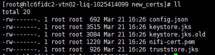
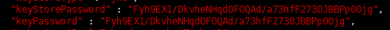

# HƯỚNG DẪN TẠO CERTIFICATE CHO CLUSTER APACHE NIFI

Điều kiện áp dụng:

-	Cụm cluster gồm 3 node Apache nifi trở lên

-	Download Apache Nifi Toolkit


## Mục lục

- [1.1. Cấu hình các thông số máy chủ ](#cauhinhmaychu)
    - [1.1.1. Cấu hình hostname (Cần quyền root)](#cauhinhhostname)
    - [1.1.2. Cấu hình iptables/firewalld (Cần quyền root)](#cauhinhiptables)
    - [1.1.3. Cài đặt Java (Cần quyền root)](#caidatjava)
    - [1.1.4. Tạo user ứng dụng  (Cần quyền root)](#taouserud)


<a name="kiemtra"></a> 
## 1. Kiểm tra cấu hình hostname và iptables 

Kiểm tra các máy chủ đã được khai hostname và mở iptables

### Mở file `/etc/hosts` trên các node kiểm tra thông tin đã được khai đúng. 

Ví dụ:

```
10.254.140.97 nifi01
10.254.140.98 nifi02
10.254.140.99 nifi03
```

### Kiểm tra iptables đã được khai báo:

```
-A INPUT -s 10.254.140.97/32 -p tcp -m state --state NEW -m tcp -m multiport --dports 22,2888,3888,443,80,8080:8082,2181,8088,8443,9991 -m comment --comment "Khai bao Composable" -j ACCEPT
-A INPUT -s 10.254.140.98/32 -p tcp -m state --state NEW -m tcp -m multiport --dports 22,2888,3888,443,80,8080:8082,2181,8088,8443,9991 -m comment --comment "Khai bao Composable" -j ACCEPT
-A INPUT -s 10.254.140.99/32 -p tcp -m state --state NEW -m tcp -m multiport --dports 22,2888,3888,443,80,8080:8082,2181,8088,8443,9991 -m comment --comment "Khai bao Composable" -j ACCEPT
```

<a name="taocert"></a> 
## 2. Tạo cert 

<a name="certhost"></a> 
### 2.1. Khởi tạo 1 máy chủ cấp cert (cert host)

- Truy cập vào một node bất kỳ. Ví dụ máy chủ nifi01

- Truy cập thư mục cài đặt Nifi Toolkit

`cd /home/nifi/nifi-toolkit`

- Tạo một thư mục lưu ca cert (chứng chỉ quan trọng dùng để ký xác thực cho các chứng chỉ khác)

```
mkdir /home/nifi/ca_certs
cd /home/nifi/ca_certs
/home/nifi/nifi-toolkit/bin/tls-toolkit.sh server -c nifi01 -t DaylaTokenduoctaoboiTinhvv2 -p 9999 -d 8250
```

<a name="note"></a>
**Note:**

**Lệnh này không được ngắt trong quá trình tạo cert cho các node client**

Trong đó: 

-	`nifi01` là hostname của server sẽ chạy client

-	`DaylaTokenduoctaoboiTinhvv2` là token chiều dài tối thiểu 16 ký tự

-	`9999` là port mở để client sẽ kết nối tới server để ký certificate

-	`8250` là số ngày hiệu lực của certificate

**Lưu ý: Khi chạy xong lệnh bên trên trong thư mục ca_certs sẽ có các file *config.json* và *nifi-ca-keystore.jks*. Phải lưu trữ lại file này để phục vụ gia hạn hoặc tạo mới cho node mới join vào cluster. Nếu mất thì phải tạo lại từ đầu cho toàn bộ các node cũ và mới.**


<a name="certclient"></a> 
### 2.2. Tạo cert cho các node (cert client)

Sau khi chạy xong, mở một terminal mới để tạo cert cho client, bao gồm cả node nifi01. Kết nối tới node nifi01, nifi02, nifi03. Chạy lệnh sau:

```
mkdir /home/nifi/certs
cd /home/nifi/certs
```

    - Với nifi01: 
    /home/nifi/nifi-toolkit/bin/tls-toolkit.sh client -c nifi01 -t DaylaTokenduoctaoboiTinhvv2 -p 9999 -D 'CN=nifi01,OU=NIFI'

    - Với nifi02:
    /home/nifi/nifi-toolkit/bin/tls-toolkit.sh client -c nifi01 -t DaylaTokenduoctaoboiTinhvv2 -p 9999 -D 'CN=nifi02,OU=NIFI'

    - Với nifi03:
    /home/nifi/nifi-toolkit/bin/tls-toolkit.sh client -c nifi01 -t DaylaTokenduoctaoboiTinhvv2 -p 9999 -D 'CN=nifi03,OU=NIFI'


<a name="insertcert"></a> 
## 3. Lấy thông tin file cert và đưa cert vào thư mục /nifi/conf

Sau khi chạy xong các lệnh tạo cert, ta được file các file sau:


Trên tất cả các node mở file config.json tìm  dòng `keyStorePassword` 


Trên tất cả các node chạy lệnh sau
`keytool -importkeystore -srckeystore keystore.jks -destkeystore keystore.jks -deststoretype pkcs12`

Nhập mật khẩu vừa lấy bên trên. Ta sẽ đc 2 file gồm `keystore.jks` và `keystore.jks.old`

Copy các cert tạo ở trong folder certs tới folder conf của nifi:
`cp * home/nifi/conf`

**Lưu ý: thông tin `KeystorePasswd`, `keyPasswd`, `truststorePasswd` được lưu trữ trong file `config.json`**

-	Sửa thông tin `KeystorePasswd`, `keyPasswd`, `truststorePasswd` trong file `nifi.properties` thành các giá trị tương ứng trong file `config.json`


<a name="taocertbrowser"></a> 
## 4. Tạo cert cho browser

Ta cần tạo thêm cert cho browser khi truy cập vào cluster

Truy cập vào nifi01

```
mkdir /home/nifi/browser
cd /home/nifi/browser
/home/nifi/nifi-toolkit/bin/tls-toolkit.sh client -c nifi01 -t DaylaTokenduoctaoboiTinhvv2 -p 9999 -D CN=nifi -T PKCS12
```

**Sau khi chạy xong lệnh này có thể ngắt lệnh tạo cert host ở [Note](#note)


<a name="taolai"></a> 
## 4. Tạo lại cert cho các client

<a name="taolai1"></a> 
### 4.1. Tạo lại cert cho các client khi ca cert vẫn còn

Tình huống:

- Các file trong thư mục /home/nifi/ca_certs trên node cert host (Nifi01) vẫn còn

- Cert của các node bị mất hoặc đã bị chỉnh sửa khiến cert invalid

Trong trường hợp cần generate lại certificate, truy cập vào thư mục ca_certs ở máy chủ ban đầu và chạy lệnh sau:
`/home/nifi/tls-toolkit.sh server -F config.json -c nifi01 -t DaylaTokenduoctaoboiTinhvv2 -p 9999 -d 8250`

Trên node cần tạo cert chạy lệnh tương tự lệnh bên trên

Ví dụ:

`/home/nifi/tls-toolkit.sh client -c nifi01 -t DaylaTokenduoctaoboiTinhvv2 -p 9999 -D 'CN=nifi04,OU=NIFI'`


<a name="taolai2"></a> 
### 4.1. Tạo lại cert cho các client khi ca cert đã mất

Thực hiện lại từ đầu từ mục [2. Tạo cert](#taocert) đến mục [3. Lấy thông tin file cert và đưa cert vào thư mục /nifi/conf](#insertcert)

