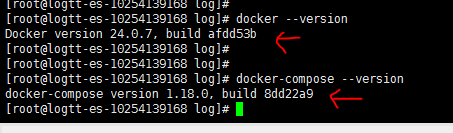
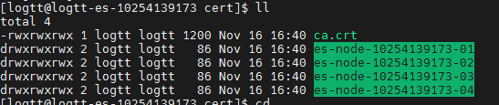

# HƯỚNG DẪN CÀI ĐẶT ELASTICSEARCH DẠNG CONTAINER DOCKER


## Mục lục

- [1.1. Cấu hình các thông số máy chủ ](#cauhinhmaychu)
    - [1.1.1. Cấu hình hostname (Cần quyền root)](#cauhinhhostname)
    - [1.1.2. Cấu hình iptables/firewalld (Cần quyền root)](#cauhinhiptables)
    - [1.1.3. Cài đặt Java (Cần quyền root)](#caidatjava)
    - [1.1.4. Tạo user ứng dụng  (Cần quyền root)](#taouserud)
    - [1.1.5. Cài đặt ứng dụng  (Cần quyền root)](#caidatud)
- [1.2. Cấu hình Apache Nifi (user nifi)](#cauhinhnifi)
    - [1.2.1. Chỉnh sửa file nifi.properties Apache Nifi ](#suafile.properties)
    - [1.2.2. Chỉnh sửa file state-management.xml](#suafile.statemanagement.xml)
    - [1.2.3. Chỉnh sửa file zookeeper.properties](#suafile.zkproperties)
    - [1.2.4. Chỉnh sửa java heap](#suajavaheap)
    - [1.2.5. Chỉnh sửa file authorizers.xml](#suafile.authorizers)
- [1.3. Khởi động và tạo user để truy cập từ web browser](#khoitao)
- [1.4. Truy cập nifi từ PC](#chay)


## 1. Cấu hình thông số máy chủ (Cần quyền root)


### 1.1. Kiểm tra số lượng file tối đa user được phép tạo

Chạy lệnh sau để kiểm tra: 

    ulimit –n

- Nếu console trả về 1024, cần phải tăng giới hạn lên trước khi cài đặt agent.

- Thêm những dòng sau vào file `/etc/security/limits.conf` rồi khởi động lại OS để các biến môi trường này được áp dụng:

    root soft nofile 65536
    root hard nofile 65536
    * soft nofile 65536
    * hard nofile 65536

- Thay đổi tham số `vm.max_map_count` (cần quyền sudo) lên `262144` thông qua file `/etc/sysctl.conf`. Cần reboot để áp dụng hoặc thông qua câu lệnh để áp dụng ngay lập tức (restart lại OS sẽ mất)
    
    sysctl -w vm.max_map_count=262144 

### 1.2. Tạo user ứng dụng (Cần quyền root)

Chạy lệnh sau để tạo user ứng dụng:

    useradd logtt && passwd logtt

Nhập mật khẩu cho user logtt

- Gán quyền thực thi lệnh docker cho user ứng dụng:

    echo -e "\nlogtt ALL=(root) NOPASSWD: /usr/bin/systemctl restart docker, /usr/bin/systemctl stop docker, /usr/bin/systemctl start docker"| sudo tee -a /etc/sudoers 2>/dev/null

- Gán user `logtt` vào group `wheel`

    usermod -aG wheel logtt && usermod -aG docker logtt


### 1.3. Chỉnh sửa file limits.conf và sysctl.conf (Cần quyền root)

- Copy file limits.conf  vào thư mục `/etc/security`, file  vào thư mục `/etc/` trên server định cài, sau đó nhớ reboot server. File `limits.conf` chứa thông tin về `nproc` và `nofile` của user, file `sysctl.conf` chứa thông tin về `vm.max_map_count` và `net.ipv4.ip_forward=0` để giao tiếp giữa container thuộc 2 host khác nhau.

## 2. Cài đặt Elasticsearch

### 2.1. Cài đặt Java (Cần quyền root)

Tuỳ thuộc vào phiên bản của Elasticsearch muốn cài để xác định phiên bản của Java 

Tham khảo hướng dẫn sau:
[Installation](https://www.elastic.co/guide/en/elasticsearch/client/java-api-client/current/installation.html)

- Download file package của Java vào trong server hoặc download trực tiếp từ trang chủ Oracle. Câu lệnh dưới hướng dẫn cài đặt khi đã đưa file package vào trong máy chủ Centos:

    yum install –y jdk-17.0.9_linux-x64_bin.rpm

### 2.2. Chỉnh sửa repo (Optional) 

Đối với các máy chủ bị chặn kết nối internet, cần phải cấu hình để tải được các package thông qua repository tập trung

Tham khảo:

 

### 2.3. Cài docker-ce và docker compose (Cần quyền root)

Cài docker:

    yum install –y docker-ce docker-ce-cli containerd.io docker-buildx-plugin docker-compose-plugin

Cài docker-compose:
    
    yum install –y docker-compose
    
Kiểm tra phiên bản sau khi cài:

    docker --version
    docker-compose --version

 

### 2.4. Chỉnh sửa daemon.json (Optional) (Cần quyền root)

Mục đích của chỉnh sửa `daemon.json` trong thư mục `/etc/docker/daemon.json` là để trỏ repo ra dockerhub khi chúng ta cần pull/push image lên/xuống docker hub.

Chỉnh sửa file `/etc/docker/daemon.json` trên server đã cài docker theo mẫu sau: 

```
{
        "live-restore": true,
        "insecure-registries": ["10.240.201.50:8890", "10.240.201.50:8891", "10.60.129.132:8890", "10.60.129.132:8891"],
        "log-driver": "local",
        "log-opts": {
            "max-size": "256m",
            "max-file": "20",
            "compress": "true"
        }
}
```

Tham khảo file đính kèm: 


### 2.5. Tạo thư mục để cài đặt và lưu trữ dữ liệu Elasticsearch (ES) (Cần quyền root)

Với mỗi server sẽ có số lượng phân vùng khác nhau, tiêu chí phân chia phân vùng là:

- Mỗi node es ở một phân vùng
- Các node còn lại (kafka, kafka-connect, kibana) vào 1 phân vùng 

Các file `docker-compose.yml`, `Dockerfile` sẽ được lưu trên phân vùng `/u01`

Tạo các phân vùng chứa data và log của các node (Ví dụ cho node 4 phân vùng của 4 node ES)

```
mkdir -p /u01/logtt/elasticsearch/data && mkdir -p /u01/logtt/elasticsearch/log
mkdir -p /u02/logtt/elasticsearch/data && mkdir -p /u02/logtt/elasticsearch/log
mkdir -p /u03/logtt/elasticsearch/data && mkdir -p /u03/logtt/elasticsearch/log
mkdir -p /u04/logtt/elasticsearch/data && mkdir -p /u04/logtt/elasticsearch/log
```

Các thư mục được tạo (log và data) phụ thuộc vào file `docker-compose.yml`. Chú ý đọc file này để tạo các thư mục đúng.

### 2.6. Thay đổi homedir của user `logtt` (Cần quyền root)

Mục đích để thay đổi thư mục homedir mặc định của user logtt từ `/home/logtt` sang phân mục tạo ở mục 1.8. 

Khi truy cập vào user ứng dụng, mặc định ta vào thư mục chứa các file cấu hình và log của Elasticsearch

Thực hiện:

- Copy các file bash trong `homedir` hiện tại của user `logtt` sang thư mục mới:

    cd /home/logtt && cp .bash_logout /u01/logtt && cp .bash_profile /u01/logtt && cp .bashrc /u01/logtt

- Phân quyền cho thư mục và các file trong thư mục:

    chown  -R logtt:logtt /u01/logtt/ && chmod  -R  777 /u01/ && chown  -R logtt:logtt /u02/logtt/ && chmod  -R  777 /u02/ &&  chown  -R logtt:logtt /u03/logtt/ && chmod  -R  777 /u03/ &&  chown  -R logtt:logtt /u04/logtt/ && chmod  -R  777 /u04/

- Chuyển home dir user `logtt` sang `/u01/logtt`

    usermod –d /u01/logtt logtt

**Từ sau bước này dùng user `logtt`, trước mỗi lệnh thêm từ `sudo` vào**

### 2.7. Tạo file docker-compose và Dockerfile

File docker-compose là file chính dùng cài đặt và cấu hình ứng dụng. 

File Dockerfile là file dùng để khởi tạo image ban đầu bằng cách tải image từ Dockerhub về và chỉnh sửa một số quyền cơ bản cho user

Đối với Elasticsearch, ta có thể tham khảo cấu hình mẫu bên dưới. Có thể thay đổi linh hoạt tuỳ theo mục đích và tài nguyên của máy chủ.


Ngoài ra, trong thư mục chứa Dockerfile và docker-compose.yml cần một số file để cấu hình tham số ban đầu cho ứng dụng bao gồm:

- : Cấu hình tài khoản ban đầu của ứng dụng ES 

- : Cấu hình các tham số jvm heap 

- : Cấu hình log của ES 

## 3. Bổ sung certificate cho cluster

Khi triển khai ứng dụng Elasticsearch, thông thường sẽ triển khai một cụm (cluster) gồm nhiều node. Các node mặc định có thể giao tiếp với nhau mà không cần chứng chỉ (certificate). Tuy nhiên để đảm bảo yêu cầu về bảo mật, các node trong cluster cần bổ sung thêm chứng chỉ. Các chứng chỉ này được tạo bởi hướng dẫn tạo chứng chỉ 

Sau khi đã có chứng chỉ, ta chuyển chúng đến từng máy chủ và thư mục tương ứng.

### 3.1. Tạo một thư mục để lưu các file cert 

Chú ý thư mục này phải được mapping giống cấu hình trong file 

Tạo thư mục bằng lệnh sau:

    mkdir /u01/logtt/docker-compose/elasticsearch/cert

Chú ý:
Trong trường hợp một server chứa nhiều node (mỗi node là một container) thì vẫn có thể để 1 thư mục chung để chứa file cert

Chuyển file `ca.crt` và các thư mục chứa cert của các node vào thư mục trên, ví dụ:




### 3.2. Thêm quyền 777 cho /u01/logtt/elasticsearch

Mục đích là cấp quyền cho user bên trong container có quyền đọc các file cấu hình và certificate

    chmod –R 777 /u01/logtt/elasticsearch/*


### 3.3. Build Container tại thư mục chứa file compose

    docker-compose up –d --build
