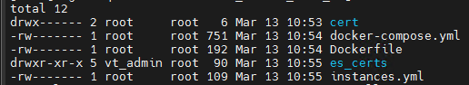
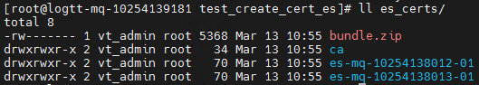
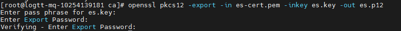
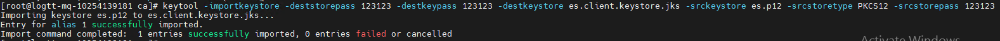
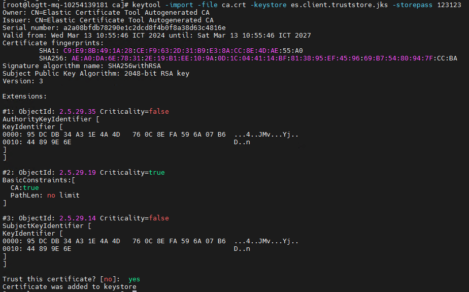
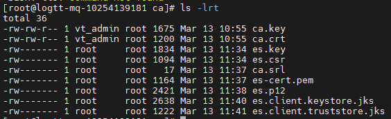

# HƯỚNG DẪN TẠO CERTIFICATE CHO CLUSTER ELASTICSEARCH

Phiên bản Elasticsearch: 8.x trở lên
Phiên bản Kafka Connect: 7.x trở lên
Phiên bản Openssl: Hiện đang sử dụng `OpenSSL 1.0.2k-fips  26 Jan 2017` hoặc bất kỳ phiên bản OpenSSL nào cũng được.
Phiên bản `elasticsearch-certutil`: Đi kèm với phiên bản Elasticsearch 8.x tương ứng.


## Mục lục

- [1. Tạo certificate cho Elasticsearch](#1)
    - [1.1. Kiểm tra cấu hình máy chủ](#1.1)
    - [1.2. Tạo certificate](#1.2)
      - [1.2.1. Tạo file docker-compose.yml](#1.2.1)
      - [1.2.2. Tạo file Dockerfile](#1.2.2)
      - [1.2.3. Tạo file biến môi trường](#1.2.3)
      - [1.2.4. Tạo file liệt kê các instances sử dụng cert](#1.2.4)
      - [1.2.5. Khởi động container tạo cert](#1.2.5)
      - [1.2.6. Chuyển các file cert về node (container) tương ứng](#1.2.6)
    - [1.3. Tạo thêm certificate cho node mới](#1.3)
- [2. Tạo certificate cho Kafka Connect](#2)


Để tạo certificate cho 1 cluster Elasticsearch, ta sử dụng một server để làm môi trường tạo cert để môi trường đồng nhất.

Việc tạo cert ES có thể sử dụng user ứng dụng để chạy các lệnh bên dưới.

<a name="1"></a>
## 1. Tạo certificate cho Elasticsearch

<a name="1.1"></a>
### 1.1. Kiểm tra cấu hình máy chủ

Nếu sử dụng một máy chủ đã được cấu hình theo Hướng dẫn  thì không cần kiểm tra lại!

Kiểm tra cấu hình của máy chủ tạo cert:

- Kiểm tra cấu hình repo

- Kiểm tra đã cài đặt docker và docker-compose

<a name="1.2"></a>
### 1.2. Tạo certificate

<a name="1.2.1"></a>
#### 1.2.1. Tạo file docker-compose.yml

Tạo thư mục để lưu file `docker-compose.yml` và các file cert

```
mkdir -p /u01/logtt/docker-compose/create_certs_es/cert
cd /u01/logtt/docker-compose/create_certs_es/cert
```

Tạo file `docker-compose.yml`:

    vim docker-compose.yml

Thêm nội dung bên dưới vào file:

```
version: '2.2'
services:
  create_certs:
    build: ./
    image: 10.60.129.132:8890/elasticsearch:8.10.2
    container_name: create_certs
    command: >
      bash -c '
        if [[ ! -f /certs/bundle.zip ]]; then
          bin/elasticsearch-certutil ca --pem --out ca.zip;
          unzip ca.zip;
          cp -R ca/ /certs/;
          bin/elasticsearch-certutil cert --ca-cert ./ca/ca.crt --ca-key ./ca/ca.key --silent --pem  --in config/certificates/instances.yml --out /certs/bundle.zip;
          unzip /certs/bundle.zip -d /certs;
        fi;
        chown -R 1000:0 /certs
      '
    user: "0"
    working_dir: /usr/share/elasticsearch
    volumes: ['./es_certs:/certs', '.:/usr/share/elasticsearch/config/certificates']
volumes: {"certs"}
```

<a name="1.2.2"></a>
#### 1.2.2. Tạo file Dockerfile

Chạy lệnh sau để thêm file Dockerfile:

    vim Dockerfile

Thêm nội dung sau vào file:

```
FROM 10.60.129.132:8890/elasticsearch:8.10.2
USER root

#Setup time
ENV TZ=Asia/Ho_Chi_Minh
RUN ln -snf /usr/share/zoneinfo/$TZ /etc/localtime && echo $TZ > /etc/timezone

USER elasticsearch
```

<a name="1.2.3"></a>
#### 1.2.3. Tạo file biến môi trường

Chạy file sau để tạo file `.env`

    vi /u01/logtt/docker-compose/create_certs_es/.env

Thêm nội dung sau vào file:

```
COMPOSE_PROJECT_NAME=es
CERTS_DIR=/usr/share/elasticsearch/config/certificates
ELASTIC_PASSWORD=1Qazse$,.<>
```

<a name="1.2.4"></a>
#### 1.2.4. Tạo file liệt kê các instances sử dụng cert

Những module sử dụng cert: Elasticsearch, Kibana


Tạo file `instances.yml`

    vi /u01/logtt/docker-compose/create_certs_es/instances.yml

Thêm nội dung theo mẫu sau vào file:

```
instances:
  - name: "es-node-10254139177-01"
    ip:
      - "10.254.139.177"
  - name: "es-node-10254139177-02"
    ip:
      - "10.254.139.177"
  - name: "es-node-10254139177-03"
    ip:
      - "10.254.139.177"
  - name: "es-node-10254139177-04"
    ip:
      - "10.254.139.177"
```

Trong đó:

- `"es-node-10254139177-02"` là hostname của container trong file  và cũng là tên của thư mục sẽ chứa các file cert sau khi tạo

- Hostname của container khác hostname của server nơi chạy container. Hostname của container được định nghĩa trong file docker-compose.yml

- `10.254.139.177` là ip của máy chủ chứa node (container)

**LƯU Ý: với trường hợp cài đặt nhiều hơn 1 node (container) Elasticsearch/Kibana trên cùng 1 server, sử dụng cùng IP, chỉ thay đổi con số đếm phía sau ở trường name.**

<a name="1.2.5"></a>
#### 1.2.5. Khởi động container tạo cert

Chạy lệnh sau:

    docker-compose -f docker-compose.yml run --rm create_certs

Xác nhận cert đã được tạo thành công thông qua kết quả đầu ra

Kiểm tra lần 2 xác nhận dữ liệu đã được lưu đầy đủ

    ll /u01/logtt/docker-compose/create_certs_es



    ll /u01/logtt/docker-compose/create_certs_es/es_certs/



<a name="1.2.6"></a>
#### 1.2.6. Chuyển các file cert về node (container) tương ứng

**LƯU Ý: Khi chuyển dữ liệu cần đảm bảo đủ các file sau (KHÔNG ĐƯỢC CHUYỂN file `ca.key` ra khỏi node chứa instance tạo cert)**

- file `ca.crt`

- file `.crt` và `.key` có tên tương ứng của node được tạo

<a name="1.3"></a>
### 1.3. Tạo thêm certificate cho node mới

Với những node (container) được tích hợp bổ sung mới sau thời điểm quy hoạch ban đầu, có thể bổ sung cert cho các node này thông qua việc sử dụng một node Elasticsearch đang hoạt động ở máy chủ bất kỳ node nào đang có các file `ca.crt` và `ca.key` được tạo ở mục [2](#2)

Ta chạy lệnh sau:

    docker exec -it es01 bin/elasticsearch-certutil cert --ca-cert /usr/share/elasticsearch/config/certificates/ca/ca.crt --ca-key /usr/share/elasticsearch/config/certificates/ca/ca.key --name kibana-10254138015 --keysize 2048 --pem  --days 3650 --ip 10.254.138.15 --out /usr/share/elasticsearch/config/certificates/kibana-10254138015.zip

Trong đó: 

-	`es01`: tên container elasticsearch

-	`/usr/share/elasticsearch/config/certificates/ca/ca.crt`: Đường dẫn đến file ca.crt được tạo ở mục [1.2](#1.2)

-	`/usr/share/elasticsearch/config/certificates/ca/ca.key`: Đường dẫn đến file ca.key được tạo ở mục [1.2](#1.2)

-	`kibana-10254138015`: tên của file cert

-	`3650`: số ngày hết hạn của cert

-	`10.254.138.15`: địa chỉ IP máy chủ nơi chạy ứng dụng cần cấp cert mới

-	`/usr/share/elasticsearch/config/certificates/kibana-10254138015.zip`: Đường dẫn đến nơi lưu các file cert được nén thành file .zip


Sau khi tạo thành công cert, tiến hành chuyển dữ liệu cert về các instance tương ứng.


<a name="2"></a>
## 2. Tạo certificate cho Kafka Connect

Khi tạo connector, Kafka Connect cần sử dụng cert để có thể kết nối tới Elasticsearch Cluster. Do đó cần cấp certificate cho Kafka Connect, ở đây sử dụng certificate dạng file .jks.

- Tạo thư mục lưu các file cert chuẩn bị tạo

        mkdir -p /u01/logtt/Kafka_connect/cert

- Chuyển các file `ca.key` và `ca.crt` được tạo ở mục [1.2](#1.2) vào thư mục vừa tạo

- Tạo file es.key và yêu cầu chứng chỉ es.csr 

        openssl  req -new -keyout es.key -out es.csr


- Điền password `123123`. Sau đó điền thông tin dịch vụ, tham khảo thông tin bên dưới


- Sử dụng ca.key và ca.crt để ký yêu cầu chứng chỉ es.csr tạo ra file es-cert.pem

        openssl x509 -req -CA ca.crt -CAkey ca.key -in es.csr -out es-cert.pem -days 3650 -CAcreateserial


- Export file es.p12 từ es-cert.pem 

        openssl pkcs12 -export -in es-cert.pem -inkey es.key -out es.p12

- Nhập mật khẩu đã tạo ở bước bên trên `123123`



- Chuyển đổi keystore từ định dạng PKCS#12 `es.p12` sang định dạng Java KeyStore `es.client.keystore.jks`

`chuyển đổi keystore từ định dạng PKCS#12 (es.p12) sang định dạng Java KeyStore (es.client.keystore.jks)`



- Import `ca.crt` vào file `es.client.truststore.jks`

        keytool -import -file ca.crt -keystore es.client.truststore.jks -storepass 123123

- Nhập `yes`



- Sau khi kết thúc các lệnh trên, ta được các file sau:



Ta chỉ cần giữ lại các file `ca.key`, `ca.crt`, `es.client.keystore.jks`, `es.client.truststore.jks`. Các file còn lại có thể xóa

Chuyển file `es.client.keystore.jks`, `es.client.truststore.jks` qua các node Kafka Connect để sử dụng cho việc tạo connector

Tất cả các node Kafka-Connect chỉ cần 2 file trên là được.
