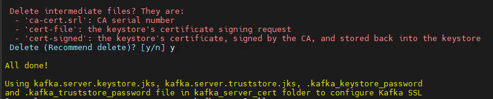
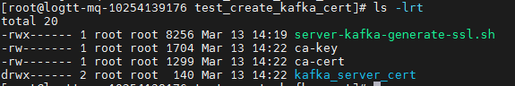
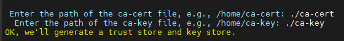
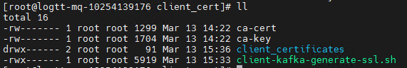

# HƯỚNG DẪN TẠO CERTIFICATE CHO CLUSTER KAFKA, KAFKA CONNECT AND FLUENTD

Phiên bản Kafka: 7.x trở lên
Phiên bản Kafka Connect: 7.x trở lên
Phiên bản Openssl: Hiện đang sử dụng OpenSSL 1.0.2k-fips  26 Jan 2017 hoặc bất kỳ phiên bản OpenSSL nào cũng được.
Phiên bản Fluentd bất kỳ

**Các bước thực hiện trong hướng dẫn này cần được thực hiện ở một server chạy các node (container) trong cùng một Cluster Kafka**

## Mục lục

- [1. Tạo certificate mới cho các node thuộc Kafka Cluster (Kafka server)](#1)
- [2. Cấp certificate cho Kafka Connect](#2)
- [3. Tạo certificate cho Fluentd](#3)

Để tạo certificate cho Kafka cluster và các thành phần liên quan Fluentd, Kafka Connect ta sử dụng script đã được viết sẵn. Ta có thể thay đổi các giá trị credential của cert bên trong script  và :

 

### 1. Tạo certificate mới cho các node thuộc Kafka Cluster (Kafka server)

- Tạo thư mục để lưu các file cert

        mkdir -p /u01/logtt/Kafka/gen_cert

- Lưu file  để tạo cert

- Cấp quyền cho file script

        cd  /u01/logtt/Kafka/gen_cert  && chmod +x server-kafka-generate-ssl.sh

- Chạy script

        .server-kafka-generate-ssl.sh

- Nhập `y` để generate cert mới

 

- Sau đó script sẽ generate toàn bộ file cert và xuất hiện lựa chọn xóa các file thừa sau khi tạo thành công chúng ta nhập `y`

 

- Kiểm tra các file certificate sau khi tạo thành công:

        ls -lrt /u01/logtt/Kafka/gen_cert

 

Ta được thư mục chứa các file certificate `kafka_server_cert` kèm 2 file `ca-key` và `ca-cert` cần được lưu lại để có thể cấp lại certificate cho Fluentd sau này. 

- Đưa các file cert trong thư mục `kafka_server_cert` tới các máy chủ chạy node (container) Kafka để tiến hành cài đặt theo hướng dẫn 

### 2. Cấp certificate cho Kafka Connect

Vì Kafka Connect như một thành phần bên trong cụm Kafka server, nên sau khi generate xong cert cho Kafka Server, ta có thể sử dụng cert đó để dùng cho Kafka Connect.
Để tránh nhầm lẫn file cert, ta sao chép và đổi tên file thành `kafka.connect.keystore.jks` và `kafka.connect.truststore.jks`. Sau đó chuyển các file cert tới node Kafka Connect tương ứng để cài đặt.

### 3. Cấp certificate cho Fluentd

- Bước 1. Tạo thư mục để lưu các file cert

        mkdir -p /u01/logtt/Fluentd/gen_cert

- Bước 2. Chuyển file script vào trong thư mục trên

- Bước 3. Cấp quyền execute cho script

        cd  /u01/logtt/Fluentd/gen_cert  && chmod +x server-kafka-generate-ssl.sh

- Bước 4. Chạy script

        ./client-kafka-generate-ssl.sh

- Bước 5. Nhập `y` để generate certificate mới

 

- Bước 6: Nhập địa chỉ lưu file ca-cert và ca-key được tạo ở mục [1](#1)

Đợi quá trình tạo cert hoàn thành, xuất hiện lựa chọn có muốn xóa các file thừa không, nhập `y`

- Bước 7. Kiểm tra thư mục đã có thư mục chứa file cert cần tạo:

Chuyển các file bên trong thư mục `client-cert.pem`, `client-key.pem`, `CA_cert.pem` cho phía ứng dụng để cài agent sử dụng SSL.

